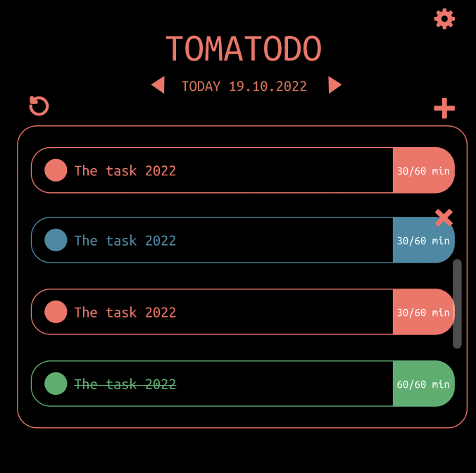
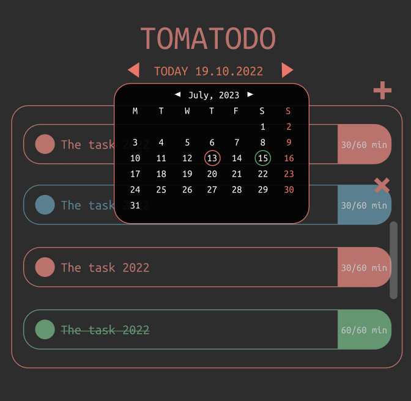
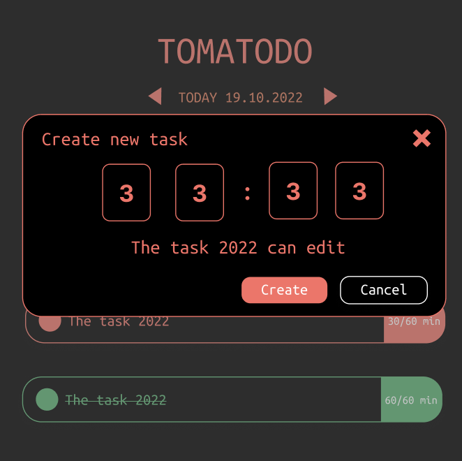
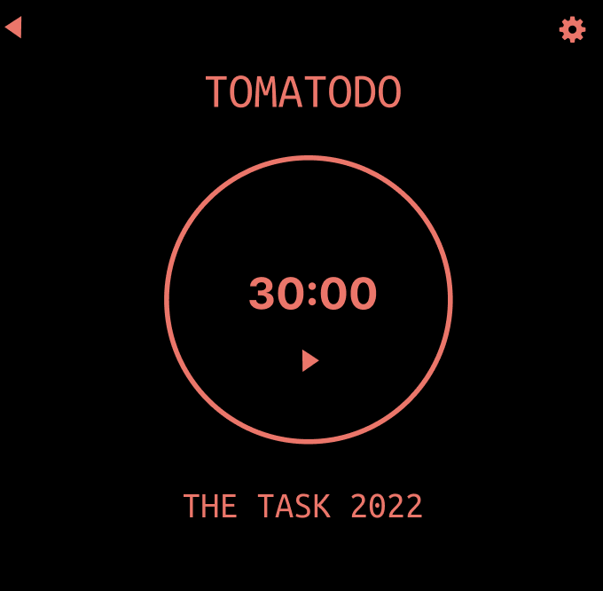
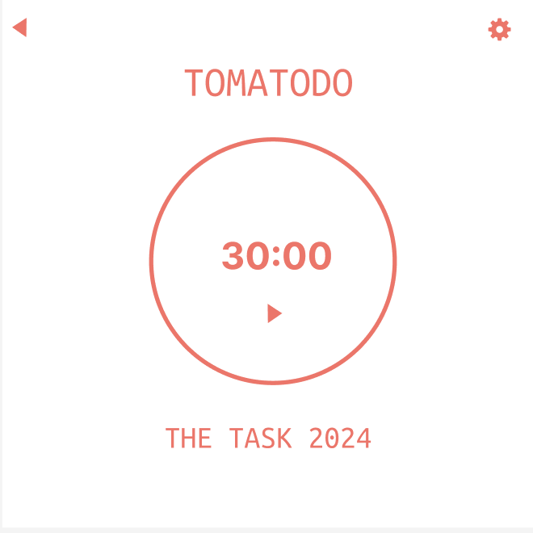

# TOMATODO
TOMATO + TODO

This is a time management app based on the **Pomodoro** Technique, designed to help you boost productivity and maintain focus. Built using the Qt Framework, C++, and QML, the app provides an intuitive interface and seamless functionality for managing your work sessions. With support for customizable timers, you can tailor the app to your preferred Pomodoro intervals, making it easier to stay on track and avoid burnout

### Screenshot






### How to build
## Building QOwnNotes

You can also check out the code directly from the git repository:

```shell
git clone https://github.com/thanhdat369/TOMATODO_DesktopApp
cd TOMATODO_DesktopApp
```

Then download and install the [Qt Creator](https://www.qt.io/download-open-source)

Afterward open the project file `TOMATODO/CmakeLists.txt` and click on
**Build** / **Build Project**.

Or you can build it directly in your terminal:

```shell
cd TOMATODO

##RunCMake
cmake -S <source_path> -B <output_build_path>
##Build: 
cmake --build <output_build_path> --target all
```
